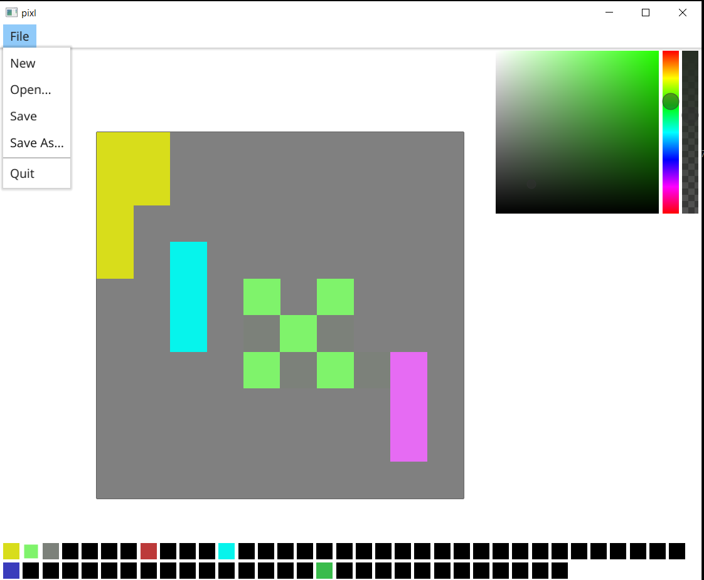

# pixl
  

## About

This is a simple Pixel Art Go application that I created to practice my Go skills. You can clone it and run it locally if you want to play around or create something similar.

## Run locally

- Before you clone this repository, make sure you have Go downloaded into your machine.

  [golang installation](https://go.dev/dl/)

- In your terminal navigate to the folder you want to clone this project into and run this command: 

  `git clone https://github.com/ajsaenz1091/pixl.git`
  
- Once you cloned the project, make sure you cd into it. In other words navigate to it from your command line using the "cd" command.

  `cd pixl/`
  
- Now that you are in the root directory, you can run this command to start the application and start creating your pixel art:

  `go run -v ./pixl`
  
  If you get any errors after running that command, try running `go mod tidy` and then run the previous command again. 
